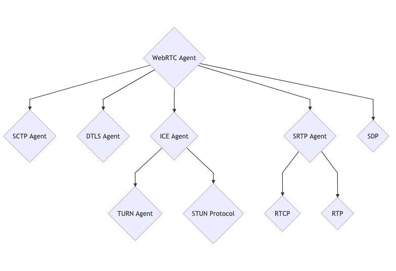
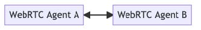
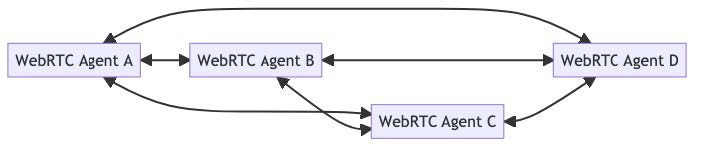
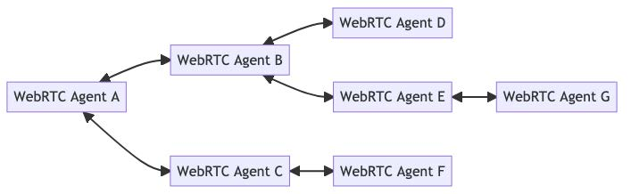
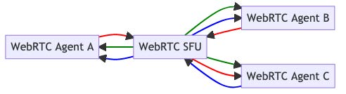
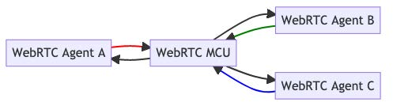

# WebRTC In Points

## What is WebRTC ?

1. WebRTC, short for Web Real-Time Communication, is both an API and a Protocol.

2. The WebRTC protocol is a set of rules for two WebRTC agents to negotiate bi-directional secure real-time communication. The WebRTC API then allows developers to use the WebRTC protocol. The WebRTC API is specified only for JavaScript. The WebRTC protocol is available in other APIs and languages besides JavaScript.

3. The WebRTC protocol is maintained in the **IETF** in the rtcweb working group.
   The WebRTC API is documented in the **W3C** as webrtc.

4. **Signaling** is used to bootstrap the call, allowing two independent WebRTC agents to start communicating.
   Signaling uses an existing, plain-text **protocol called SDP (Session Description Protocol)**.
   The SDP that the two WebRTC agents exchange contains details like:
   • The _IPs_ and _Ports_ that the agent is reachable on (candidates).
   • The _number of audio and video tracks_ the agent wishes to send.
   • The audio and video codecs each agent supports.
   • The values used while connecting (uFrag/uPwd).
   • The values used while securing (certificate fingerprint).

5. Once two WebRTC agents have exchanged SDPs, they have enough information to attempt to connect to each other. To make this connection happen, WebRTC uses another established technology called **ICE (Interactive Connectivity Establishment).** **ICE is a protocol** that pre-dates WebRTC and allows the establishment of a direct connection between two agents without a central server.
   ICE enables direct connection, but the real magic of the connecting process involves a concept called _‘NAT Traversal’_ and the use of STUN/TURN Servers.

6. When the two agents have successfully established an ICE connection, WebRTC moves on to the next step; establishing an encrypted transport for sharing audio, video, and data between them.

7. **new RTCPeerConnection** is the top-level “WebRTC Session”. It contains all the protocols mentioned above.

8. **addTrack** creates a new RTP _(Real-time Transport Protocol)_ stream. A random Synchronization Source (SSRC) will be generated for this stream. This stream will then be inside the Session Description generated by createOffer inside a media section. Each call to addTrack will create a new SSRC and media section.

9. **createDataChannel** creates a new SCTP stream if no SCTP association exists. SCTP is not enabled by default. It is only started when one side requests a data channel.

10. **createOffer** generates a Session Description of the local state to be shared with the remote peer.

11. **setLocalDescription** commits any requested changes. _setLocalDescription_ is called with the value generated by _createOffer_.

12. **setRemoteDescription** is how we inform the local agent about the state of the remote candidates. This is how the act of ‘Signaling’ is done with the JavaScript API.

13. **addIceCandidate** allows a WebRTC agent to add more remote ICE Candidates at any time.

14. **ontrack** is a callback fired when an RTP packet is received from the remote peer.

15. **oniceconnectionstatechange** is a callback that is fired which reflects a change in the state of an ICE agent.

16. **onconnectionstatechange** is a combination of ICE agent and DTLS agent state.

## WebRTC Topologies

WebRTC is a protocol for connecting two agents, so how are developers connecting hundreds of people at once?

### One-To-One

One-to-One is the first connection type you will use with WebRTC. You connect two WebRTC Agents directly and they can send bi-directional media and data. The connection looks like this.

### Full Mesh

Full mesh is the answer if you want to build a conference call or a multiplayer game. In this topology each user establishes a connection with every other user directly. This allows you to build your application, but it comes with some downsides. In a Full Mesh topology each user is connected directly. That means you have to encode and upload video independently for each member of the call. The network conditions between each connection will be different, so you can’t reuse the same video. Error handling is also difficult in these deployments. You need to carefully consider if you have lost complete connectivity, or just connectivity with one remote peer.

### Hybrid Mesh

Hybrid Mesh is an alternative to Full Mesh that can alleviate some of the Full Mesh’s issues. In a Hybrid Mesh connections aren’t established between every user. Instead, media is relayed through peers in the network. This means that the creator of the media doesn’t have to use as much bandwidth to distribute media.

### Selective Forwarding Unit (SFU)

An SFU implements a client/server topology, instead of P2P. Each WebRTC peer connects to the SFU and uploads its media. The SFU then forwards this media out to each connected client.
With an SFU each WebRTC Agent only has to encode and upload their video once.

Connectivity with an SFU is much easier than P2P as well. You can run an SFU on a world routable address, making it much easier for clients to connect. You don’t need to worry about NAT Mappings. You do still need to make sure your SFU is available via TCP (either via ICE-TCP or TURN)

### Multi-point Conferencing Unit (MCU)

A MCU is a client/server topology like an SFU, but composites the output streams. Instead of distributing the outbound media unmodified it re-encodes them as one feed.

